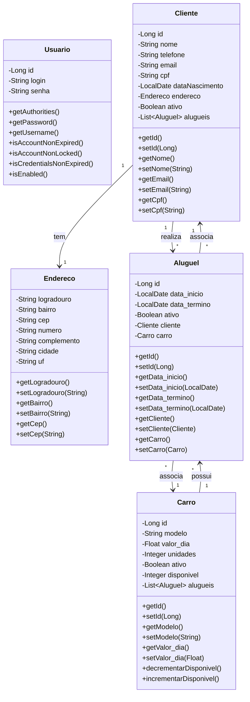

# Sistema de Aluguel de Carros API

[](https://openjdk.java.net/projects/jdk/17/)
[](https://spring.io/projects/spring-boot)
[](https://www.postgresql.org/)
[](LICENSE)

Sistema completo de gerenciamento de aluguel de carros desenvolvido em Java com Spring Boot. Oferece funcionalidades robustas para controle de clientes, veículos, aluguéis e autenticação de usuários.

## Índice

- [Funcionalidades](#funcionalidades)
- [Tecnologias](#tecnologias)
- [Pré-requisitos](#pré-requisitos)
- [Instalação](#instalação)
- [Configuração](#configuração)
- [Uso](#uso)
- [API Documentation](#api-documentation)
- [Estrutura do Projeto](#estrutura-do-projeto)
- [Tratamento de Erros](#tratamento-de-erros)
- [Segurança](#segurança)
- [Contribuição](#contribuição)
- [Licença](#licença)

## Funcionalidades

### Autenticação e Autorização
- Sistema de login com JWT
- Controle de acesso baseado em roles
- Tokens seguros com expiração

### Gestão de Clientes
- Cadastro, edição e consulta de clientes
- Validação de CPF (Stella)
- Endereços completos
- Controle de status ativo/inativo
- Histórico de aluguéis

### Gestão de Veículos
- Cadastro e manutenção da frota
- Controle de disponibilidade
- Informações detalhadas dos veículos
- Status ativo/inativo

### Gestão de Aluguéis
- Criação de contratos de aluguel
- Validação de disponibilidade de carros
- Validação de cliente ativo
- Controle de um aluguel ativo por cliente
- Validação de datas (não permite domingos)
- Histórico completo de aluguéis

### Consultas e Relatórios
- Listagem de aluguéis ativos/inativos
- Busca por ID
- Filtros por status

## Tecnologias

- **Java 17** - Linguagem principal
- **Spring Boot 3.3.3** - Framework principal
- **Spring Security** - Autenticação e autorização
- **Spring Data JPA** - Persistência de dados
- **PostgreSQL 12+** - Banco de dados
- **Flyway** - Migração de banco de dados
- **JWT** - Tokens de autenticação
- **Lombok** - Redução de boilerplate
- **SpringDoc OpenAPI** - Documentação da API
- **Stella** - Validação de CPF
- **Maven** - Gerenciamento de dependências

## Pré-requisitos

- Java 17 ou superior
- PostgreSQL 12 ou superior
- Maven 3.6+
- IDE (recomendado: IntelliJ IDEA, Eclipse ou VS Code)

## Instalação

1. **Clone o repositório**
   ```bash
   git clone https://github.com/GuilhermeGarap/aluguelcarros_vrs1.git
   cd aluguelcarros
   ```

2. **Configure o banco de dados**
   Execute as migrações Flyway automaticamente ou configure manualmente um banco PostgreSQL:
   ```sql
   CREATE DATABASE aluguelcarros;
   CREATE USER aluguelcarros_user WITH PASSWORD 'sua_senha';
   GRANT ALL PRIVILEGES ON DATABASE aluguelcarros TO aluguelcarros_user;
   ```

3. **Configure as variáveis de ambiente**
   Edite o arquivo `src/main/resources/application.properties` com suas credenciais do banco e JWT

4. **Execute a aplicação**
   ```bash
   mvn spring-boot:run
   ```

## Configuração

### application.properties

```properties
# Configurações da aplicação
spring.application.name=aluguelcarros_vrs1
server.port=8080

# Configurações do banco de dados
spring.datasource.url=jdbc:postgresql://localhost:5432/aluguelcarros
spring.datasource.username=aluguelcarros_user
spring.datasource.password=sua_senha
spring.datasource.driver-class-name=org.postgresql.Driver

# JPA/Hibernate
spring.jpa.hibernate.ddl-auto=validate
spring.jpa.properties.hibernate.dialect=org.hibernate.dialect.PostgreSQLDialect
spring.jpa.properties.hibernate.format_sql=true
spring.jpa.show-sql=false

# Flyway
spring.flyway.enabled=true
spring.flyway.locations=classpath:db/migration

# JWT
api.security.token.secret=seu_jwt_secret_muito_seguro_aqui
api.security.token.expiration=86400000

# Logging
logging.level.com.aluguelcarros=INFO
logging.level.org.springframework.security=DEBUG

# Locale
spring.web.locale-resolver=accept-header
spring.web.locale=pt_BR

# Tratamento de erros
server.error.include-stacktrace=never
server.error.include-message=always
```

## Uso

### 1. Autenticação

```bash
# Login
curl -X POST http://localhost:8080/autenticacao/login \
  -H "Content-Type: application/json" \
  -d '{
    "login": "logintestes@hotmail.com",
    "senha": "senhatestes"
  }'
```

### 2. Usar o token retornado

```bash
# Exemplo de requisição autenticada
curl -X GET http://localhost:8080/cliente/listar \
  -H "Authorization: Bearer SEU_TOKEN_JWT_AQUI"
```

## API Documentation

A documentação completa da API está disponível através do Swagger UI:

- **URL**: http://localhost:8080/swagger-ui.html
- **OpenAPI JSON**: http://localhost:8080/v3/api-docs

### Principais Endpoints

#### Autenticação
| Método | Endpoint | Descrição |
|--------|----------|-----------|
| POST | `/autenticacao/login` | Autenticação de usuário |

#### Clientes
| Método | Endpoint | Descrição |
|--------|----------|-----------|
| POST | `/cliente/cadastrar` | Cadastrar novo cliente |
| GET | `/cliente/listar` | Listar clientes ativos |
| GET | `/cliente/buscar/{id}` | Buscar cliente por ID |
| PUT | `/cliente/editar/{id}` | Atualizar cliente |
| DELETE | `/cliente/desativar/{id}` | Desativar cliente |
| PATCH | `/cliente/ativar/{id}` | Ativar cliente |

#### Carros
| Método | Endpoint | Descrição |
|--------|----------|-----------|
| POST | `/carro/cadastrar` | Cadastrar novo carro |
| GET | `/carro/listar` | Listar carros ativos |
| PUT | `/carro/editar/{id}` | Atualizar carro |
| DELETE | `/carro/desativar/{id}` | Desativar carro |
| PATCH | `/carro/ativar/{id}` | Ativar carro |

#### Aluguéis
| Método | Endpoint | Descrição |
|--------|----------|-----------|
| POST | `/aluguel/cadastrar` | Criar novo aluguel |
| GET | `/aluguel/listarAtivos` | Listar aluguéis ativos |
| GET | `/aluguel/listarDesativados` | Listar aluguéis desativados |
| GET | `/aluguel/listarTodos` | Listar todos os aluguéis |
| GET | `/aluguel/buscar/{id}` | Buscar aluguel por ID |
| PUT | `/aluguel/editar/{id}` | Atualizar aluguel |
| DELETE | `/aluguel/desativar/{id}` | Desativar aluguel |
| PATCH | `/aluguel/ativar/{id}` | Ativar aluguel |

## Diagrama de Classes



### Descrição das Entidades

- **Usuario**: Entidade de autenticação que implementa `UserDetails` para integração com Spring Security
- **Cliente**: Armazena dados de clientes com endereço embarcado e relacionamento com múltiplos aluguéis
- **Endereco**: Objeto embarcado no Cliente com informações de localização (sem tabela separada)
- **Carro**: Gerencia a frota com controle de disponibilidade e unidades
- **Aluguel**: Relaciona Cliente e Carro com datas de início e término

### Relacionamentos

- Um **Cliente** possui um **Endereço** (embarcado)
- Um **Cliente** pode realizar múltiplos **Aluguéis**
- Um **Carro** pode ter múltiplos **Aluguéis**
- Um **Aluguel** associa um **Cliente** e um **Carro**

## Estrutura do Projeto

```
src/main/java/com/aluguelcarros_vrs1/
├── controllers/              # Controladores REST
│   ├── AluguelController.java
│   ├── AutenticacaoController.java
│   ├── CarroController.java
│   └── ClienteController.java
├── domain/                   # Entidades e DTOs
│   ├── aluguel/
│   │   ├── Aluguel.java
│   │   ├── AluguelRepository.java
│   │   ├── DadosCadastroAluguel.java
│   │   ├── DadosDetalhamentoAluguel.java
│   │   ├── DadosEditarAluguel.java
│   │   └── DadosListaAluguel.java
│   ├── carro/
│   │   ├── Carro.java
│   │   ├── CarroRepository.java
│   │   ├── DadosCadastroCarro.java
│   │   ├── DadosDetalhamentoCarro.java
│   │   ├── DadosEditarCarro.java
│   │   └── DadosListaCarro.java
│   ├── cliente/
│   │   ├── Cliente.java
│   │   ├── ClienteRepository.java
│   │   ├── DadosCadastroCliente.java
│   │   ├── DadosDetalhamentoCliente.java
│   │   ├── DadosEditarCliente.java
│   │   └── DadosListaCliente.java
│   ├── endereco/
│   │   ├── Endereco.java
│   │   └── DadosEndereco.java
│   └── usuario/
│       ├── Usuario.java
│       ├── UsuarioRepository.java
│       ├── DadosAutenticacao.java
│       └── AutenticacaoService.java
├── domainservices/           # Serviços de domínio
│   ├── ValidacaoException.java
│   └── aluguelservices/      # Lógica de negócio de aluguéis
│       ├── AluguelService.java
│       ├── AluguelValidador.java
│       ├── AluguelValidadorData.java
│       ├── AluguelValidarCarroAtivo.java
│       ├── AluguelValidarClienteAtivo.java
│       ├── AluguelLogicaCarroDisponivel.java
│       └── ValidarSeClienteTemAluguelAtivo.java
├── config/                   # Configurações
│   └── TestConfig.java       # Dados de teste (perfil test)
└── infra/                    # Infraestrutura
    ├── exception/
    │   └── TratadorDeErros.java
    ├── security/
    │   ├── DadosTokenJWT.java
    │   ├── SecurityConfigurations.java
    │   ├── SecurityFilter.java
    │   └── TokenService.java
    └── springdoc/
        └── SpringDocConfiguration.java

src/main/resources/
├── application.properties      # Configurações padrão
├── application-test.properties # Configurações de teste
└── application-deploy.properties # Configurações de deploy
```

## Validações de Negócio

### Validações de Aluguel
- Cliente deve estar ativo
- Cliente não pode ter outro aluguel ativo
- Carro deve estar ativo
- Datas não podem ser domingo
- Data de término deve ser maior que data de início

## Tratamento de Erros

O sistema possui tratamento robusto de erros com respostas padronizadas:

### Formato de Resposta de Erro

```json
{
  "status": 400,
  "error": "Dados de entrada inválidos",
  "message": "Erros de validação encontrados",
  "path": "/api/clientes/cadastrar",
  "timestamp": "2024-01-20T10:30:00",
  "details": [
    "cpf: CPF inválido",
    "email: Email deve ser válido"
  ]
}
```

### Códigos de Status HTTP

- `200` - Sucesso
- `201` - Criado com sucesso
- `400` - Dados inválidos
- `401` - Não autorizado
- `403` - Acesso negado
- `404` - Recurso não encontrado
- `409` - Conflito de dados
- `500` - Erro interno do servidor

## Segurança

- **JWT**: Autenticação baseada em tokens com expiração configurável
- **Spring Security**: Controle de acesso robusto
- **Validação**: Validação rigorosa de entrada em todos os endpoints
- **Criptografia**: Senhas armazenadas com hash seguro
- **CORS**: Configurado para produção
- **Validação CPF**: Usando biblioteca Stella para validação de CPF

## Padrões de Desenvolvimento

- **Domain-Driven Design (DDD)**: Estrutura organizada por domínios
- **Service Layer**: Separação clara entre camadas
- **DTOs**: Data Transfer Objects para segurança e performance
- **Repository Pattern**: Acesso a dados padronizado
- **Validation Pattern**: Validadores compostos para regras de negócio


